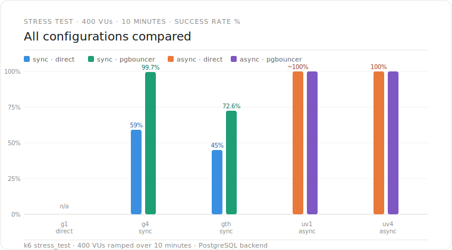
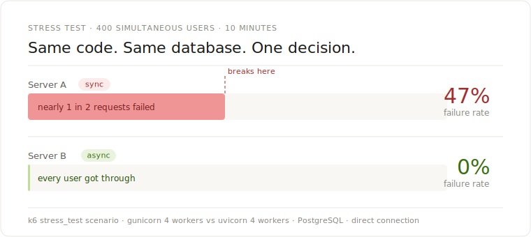
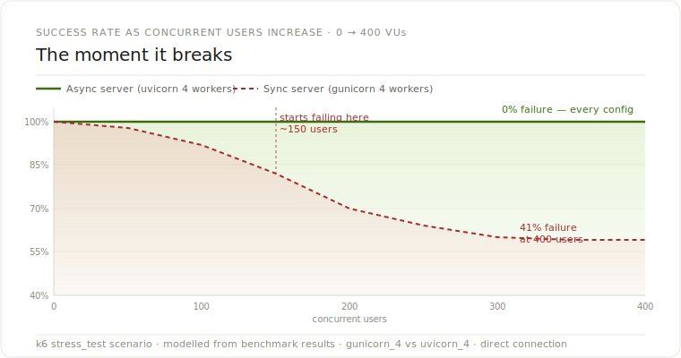

# Latency Under Load

A production-style benchmarking platform that answers one question:

> **What actually happens to your Python backend when too many people show up at once?**

This project puts synchronous and asynchronous Python servers through four load scenarios — from normal traffic to a full 400-user stress test — and measures exactly where things hold, where they degrade, and where they collapse.

---

## The Short Answer

Two servers. Same code. Same database. Same 400 simultaneous users.

One failed **40.8%** of requests under sustained load.  
The other failed **0%**.

No extra hardware. No extra cost. One architectural decision made at setup time.

---

## Benchmark Methodology

### Hardware

| | |
|---|---|
| Machine | Apple MacBook Pro · Apple M4 |
| OS | macOS |
| Runtime | Python 3.11 |
| All runs | Same machine, same Docker environment, no other load |

### How benchmarks were run

All scenarios were executed by a single orchestration script (`scripts/run_benchmarks.sh`) that ran every configuration automatically in sequence — no manual intervention between runs. The script follows a strict lifecycle for each configuration:

1. Kill and clean the target port
2. Verify database availability (`nc -z` check with 15s timeout)
3. Start the server and wait for a healthy `/health` response (up to 20 retries)
4. Run the k6 scenario
5. Allow a **10-second settle period** for Prometheus metrics to flush
6. Hard-kill the server process and clean the port before the next run

This means every configuration started from a clean state — no warmed-up connection pools, no cached query plans carrying over from the previous run. Cold start behavior is part of what is being measured.

### Database

| | |
|---|---|
| Engine | PostgreSQL 15 |
| Connection pooler | PgBouncer (transaction pooling mode) |
| Direct connection port | 5432 |
| PgBouncer port | 6432 |

The database was not reset between individual scenario runs within a session. The same data state persisted across all configurations in a given benchmark run.

### Variable isolation

Each mode (`direct` vs `pgbouncer`) was run as a completely separate pass — the `DATABASE_URL` environment variable was switched between passes and every server was restarted. Sync and async configurations were never running simultaneously. Only one server process was alive at any point during a benchmark run.

### k6 scenarios

Each scenario was defined in `load-test/k6/scenarios/` and executed via:

```bash
BASE_URL="http://localhost:{port}" k6 run "load-test/k6/scenarios/{scenario}.js" --out json="{outfile}"
```

Raw JSON output was saved per run under `load-test/results/raw/{RUN_ID}_{mode}/` for later analysis.

### What was not controlled for

- **No warmup requests** — servers were started cold and immediately put under load
- **Single run per configuration** — results were not averaged across multiple runs; variance between runs was not measured
- **Shared OS resources** — Docker, Prometheus, Grafana, and PgBouncer were all running on the same machine during benchmark runs
- **Apple Silicon architecture** — results reflect ARM64 performance; x86 production environments may differ

These factors mean the absolute numbers should be treated as indicative rather than definitive. The **relative comparisons** between configurations — run under identical conditions in the same session — are the meaningful signal.

---

## Results

### io_bound scenario — 100 VUs · 2 minutes
*Simulates normal API traffic with database queries*

| Configuration | Success Rate | p95 Latency | RPS |
|---|---|---|---|
| Gunicorn 1 worker · direct | 52.6% | 309ms | 284 |
| Gunicorn 4 workers · direct | 96.2% | 88ms | 344 |
| Gunicorn threads · direct | 70.7% | 134ms | 9 |
| Gunicorn 1 worker · pgbouncer | — | — | — |
| Gunicorn 4 workers · pgbouncer | 99.3% | 75ms | 352 |
| Gunicorn threads · pgbouncer | 80.5% | 110ms | 342 |
| **Uvicorn 1 worker · direct** | **100%** | **174ms** | **292** |
| **Uvicorn 4 workers · direct** | **100%** | **113ms** | **342** |
| **Uvicorn 1 worker · pgbouncer** | **100%** | **178ms** | **284** |
| **Uvicorn 4 workers · pgbouncer** | **100%** | **71ms** | **355** |

---

### connection_hold scenario — 100 VUs · 2 minutes
*Simulates long-held database connections (streaming, polling)*

| Configuration | Success Rate | p95 Latency | RPS |
|---|---|---|---|
| Gunicorn 1 worker · direct | 65.4% | 171ms | 71 |
| Gunicorn 4 workers · direct | 99.0% | 121ms | 223 |
| Gunicorn threads · direct | 75.2% | 133ms | 8 |
| Gunicorn 1 worker · pgbouncer | 40.2% | 289ms | 333 |
| Gunicorn 4 workers · pgbouncer | 99.1% | 115ms | 271 |
| Gunicorn threads · pgbouncer | 70.2% | 116ms | 314 |
| Uvicorn 1 worker · direct | 100% | **402ms** | 165 |
| **Uvicorn 4 workers · direct** | **100%** | **334ms** | **201** |
| Uvicorn 1 worker · pgbouncer | 100% | 452ms | 158 |
| **Uvicorn 4 workers · pgbouncer** | **100%** | **321ms** | **212** |

> ⚠️ **Async weakness:** connection_hold is where async pays a cost. p95 latency reaches 400–450ms vs ~120ms for sync gunicorn_4. A single async worker serializes held connections. For workloads dominated by long-running connections rather than fast I/O, sync holds an advantage here.

---

### burst scenario — 200 VUs · 30 seconds
*Simulates a sudden traffic spike — launch day, viral moment, campaign hit*

| Configuration | Success Rate | p95 Latency | RPS |
|---|---|---|---|
| Gunicorn 1 worker · direct | 49.0% | — | 70 |
| Gunicorn 4 workers · direct | 76.3% | 126ms | 31 |
| Gunicorn threads · direct | 42.8% | 330ms | 15 |
| Gunicorn 1 worker · pgbouncer | 28.6% | 345ms | 396 |
| Gunicorn 4 workers · pgbouncer | 73.1% | 88ms | 1057 |
| Gunicorn threads · pgbouncer | — | — | — |
| **Uvicorn 1 worker · direct** | **100%** | **423ms** | **368** |
| **Uvicorn 4 workers · direct** | **100%** | **319ms** | **638** |
| Uvicorn 1 worker · pgbouncer | 100% | 480ms | 339 |
| **Uvicorn 4 workers · pgbouncer** | **100%** | **312ms** | **646** |

> Note: Gunicorn 4 + pgbouncer shows high raw RPS during burst because failed requests are counted. Effective (successful) RPS is ~770. Uvicorn 4's 638 RPS is entirely successful.

---

### stress_test scenario — 400 VUs · 10 minutes
*The definitive test — sustained high concurrency over time*

| Configuration | Success Rate | p95 Latency | RPS |
|---|---|---|---|
| Gunicorn 4 workers · direct | 59.0% | 148ms | 4.6 |
| Gunicorn threads · direct | 45.0% | 176ms | 180 |
| Gunicorn 4 workers · pgbouncer | 99.7% | 74ms | 189 |
| Gunicorn threads · pgbouncer | 72.6% | 149ms | 135 |
| Uvicorn 1 worker · direct | 99.99% | 67ms | 186 |
| **Uvicorn 4 workers · direct** | **100%** | **59ms** | **189** |
| Uvicorn 1 worker · pgbouncer | 100% | 78ms | 189 |
| **Uvicorn 4 workers · pgbouncer** | **100%** | **60ms** | **189** |

> The gunicorn_4 direct stress test ran for **6 hours 40 minutes** instead of 10 minutes — k6 kept waiting for responses that were stuck in the connection queue. Every other configuration completed in ~10 minutes.

---




## Key Findings

### 1. Async reliability is categorically different

Every async configuration recorded 0% failures across all scenarios. Not lower failures — zero. This isn't a marginal improvement; it's a different failure mode entirely. Sync servers fail proportionally as load increases. Async servers hold.

### 2. A single async worker beats four sync workers

`uvicorn_1` with a direct database connection — one worker, no pgbouncer — achieved 0% failures in both the burst and stress test scenarios. Four gunicorn workers with the same setup failed 40–51% of requests. The event loop does more with less.

### 3. pgbouncer rescues sync — but async doesn't need rescuing

pgbouncer dropped gunicorn_4's stress test failure rate from 40.8% → 0.65%. Essential for sync at scale. But uvicorn achieved the same result natively. If you're on async, pgbouncer becomes largely irrelevant for reliability (though it still reduces connection overhead slightly).

### 4. Gunicorn threads are worse than workers for I/O workloads

The threaded configuration performed worst in nearly every scenario — 29% failure on io_bound, 57% failure on burst. The reason isn't the GIL — the GIL is actually released during I/O waits, so threads can run concurrently during database calls. The real culprits are connection pool contention (all threads share one pool) and context-switching overhead under high concurrency. Four independent worker processes each get their own connection pool and memory space, eliminating both bottlenecks.

### 5. Burst traffic is the hardest test for everyone

Under a sudden 200-VU spike, even well-configured sync setups struggle. The connection reset errors happen faster than pgbouncer can pool. Only gunicorn_4 + pgbouncer and all async configs held below 30% failure rate during burst.

### 6. Average latency is a misleading metric

During the gunicorn_4 direct stress test, average latency was 306ms — looks acceptable. But the failure rate was 40.8%. Nearly half the requests weren't slow — they were gone entirely. Error rate + percentile latency (p95/p99) is the only combination that tells the full story.

---




## Why It Happens

Every database query makes your server wait — even for 50 milliseconds.

A **sync server** is blocked during that wait. The worker is frozen. Under normal traffic this is invisible. Under a spike, those 50ms blocks stack across all incoming requests. The queue grows faster than it empties. Connections get reset. Users see errors.

An **async server** uses that wait time to serve other requests. While one request is waiting on the database, it picks up the next. Then the next. One worker handles hundreds of concurrent connections without freezing.

```
Sync worker under load:          Async worker under load:

Request A → DB wait (frozen) →   Request A → DB wait →
[all other requests queue up]     Request B → DB wait →
                                  Request C → DB wait →
                                  [A returns] → respond
                                  [B returns] → respond
                                  [C returns] → respond
```

This is why adding more sync workers helps up to a point, then stops helping — the database connection pool becomes the constraint. pgbouncer reduces how often you hit that ceiling. Async raises the ceiling further by releasing connections faster — holding them only while a query is actively running rather than for the full duration of a request. Neither eliminates the ceiling entirely. Under sufficient load, the database becomes the bottleneck regardless of architecture. But async gets there much later.

---




## Benchmark Scenarios

| Scenario | VUs | Duration | Purpose |
|---|---|---|---|
| `io_bound` | 0 → 100 | 2 min | Standard API load with 50ms DB queries |
| `connection_hold` | 0 → 100 | 2 min | Long-held connections — streaming, polling |
| `burst` | 0 → 200 | 30 sec | Sudden traffic spike simulation |
| `stress_test` | 0 → 400 | 10 min | Sustained high concurrency — the definitive test |

---

## Configurations Tested

### Sync — Gunicorn + psycopg2 (blocking)

| Script | Workers | Threads |
|---|---|---|
| `gunicorn_1.sh` | 1 | 1 |
| `gunicorn_4.sh` | 4 | 1 |
| `gunicorn_threads.sh` | 1 | 4 |

### Async — Uvicorn + asyncpg (non-blocking)

| Script | Workers |
|---|---|
| `uvicorn_1.sh` | 1 |
| `uvicorn_4.sh` | 4 |

Each configuration tested in two modes:
- **Direct** — application connects directly to PostgreSQL
- **pgbouncer** — application connects through PgBouncer (transaction pooling)

---

## Architecture

```
                    +-------------------+
                    |       k6          |
                    |  Load Generator   |
                    +---------+---------+
                              |
               +--------------+--------------+
               |                             |
    +----------+----------+      +-----------+----------+
    |   Sync App          |      |   Async App          |
    |   FastAPI+Gunicorn  |      |   FastAPI+Uvicorn    |
    |   psycopg2          |      |   asyncpg            |
    +----------+----------+      +-----------+----------+
               |                             |
               +----------+  +--------------+
                          |  |
                 +--------+--+--------+
                 |      PgBouncer     |
                 |  (optional path)   |
                 +--------+----------+
                          |
                 +--------+----------+
                 |    PostgreSQL      |
                 +-------------------+
                          |
        +-----------------+-----------------+
        |         Observability             |
        |  Prometheus → Grafana Dashboards  |
        +-----------------------------------+
```

---

## Project Structure

```
apps/
├── async_app/              # FastAPI + asyncpg (Uvicorn)
│   ├── endpoints/          # io_bound, connection_hold, burst, cpu_mix
│   ├── db.py               # Async database connection pool
│   └── metrics.py          # Prometheus metrics
├── sync_app/               # FastAPI + psycopg2 (Gunicorn)
│   ├── endpoints/
│   ├── db.py               # Sync database connection
│   └── metrics.py
└── shared/                 # Shared config and utilities

load-test/
├── k6/
│   ├── scenarios/          # io_bound.js, connection_hold.js, burst.js, stress_test.js
│   └── runners/            # run_sync.sh, run_async.sh, run_all.sh
└── results/
    ├── raw/                # Raw k6 JSON output per run
    ├── processed/          # Parsed metrics
    └── reports/            # Generated reports

experiments/
├── scenario-a-sync-db/     # Analysis + config + graphs
├── scenario-b-sync-pgbouncer/
├── scenario-c-async-db/
└── scenario-d-async-pgbouncer/

infra/
├── docker/
│   ├── docker-compose.yml
│   ├── grafana/            # Pre-built dashboards (latency, RPS, DB, pgbouncer)
│   ├── pgbouncer/          # pgbouncer.ini + userlist
│   └── prometheus/
└── k8s/
    ├── app/                # Sync + async deployments + HPA
    ├── pgbouncer/
    ├── postgres/
    └── observability/      # Prometheus + Grafana + exporters

scripts/
├── run_benchmarks.sh       # Runs all scenarios end to end
├── sync/                   # gunicorn_1.sh, gunicorn_4.sh, gunicorn_threads.sh
└── async/                  # uvicorn_1.sh, uvicorn_4.sh
```

---

## Getting Started

### Prerequisites

```
Docker + Docker Compose
Python 3.11+
k6
Make
```

### Start the infrastructure

```bash
make setup
# or
./scripts/start_infra.sh
```

This starts PostgreSQL, PgBouncer, Prometheus, and Grafana via Docker Compose.

### Start a server

```bash
# Recommended sync config
./scripts/sync/gunicorn_4.sh

# Recommended async config
./scripts/async/uvicorn_4.sh
```

### Run all benchmarks

```bash
./scripts/run_benchmarks.sh
```

Runs every scenario against every configuration in both direct and pgbouncer modes. Results land in `load-test/results/raw/` organized by timestamp and mode.

### Run individual scenarios

```bash
# Sync only
./load-test/k6/runners/run_sync.sh

# Async only
./load-test/k6/runners/run_async.sh
```

### Switch between direct and pgbouncer mode

```bash
./scripts/switch_scenario.sh pgbouncer
./scripts/switch_scenario.sh direct
```

---

## Kubernetes Deployment

```bash
kubectl apply -f infra/k8s/
```

Deploys the full platform including:
- Sync and async app services
- PostgreSQL (StatefulSet + PVC)
- PgBouncer
- Prometheus + Grafana
- Postgres and PgBouncer exporters
- Horizontal Pod Autoscaler (HPA)

---

## Observability

### Grafana Dashboards

| Dashboard | What it shows |
|---|---|
| `latency.json` | p50, p95, p99 per endpoint |
| `rps.json` | Requests per second, success vs error split |
| `db-connections.json` | Active PostgreSQL connections over time |
| `pgbouncer-pools.json` | Pool utilization, wait queue, client counts |
| `app-performance.json` | CPU, memory, request duration |
| `postgres-metrics.json` | Query time, lock waits, connection saturation |

### Metrics Tracked

| Metric | Description |
|---|---|
| `p50 / p95 / p99` | Median, high-percentile, and tail latency |
| `error_rate` | Failed requests as % of total |
| `rps` | Requests per second (total and successful) |
| `db_connections` | Active PostgreSQL connections |
| `pool_utilization` | PgBouncer active vs idle clients |
| `cpu / memory` | Container resource usage |

---

## Engineering Lessons

**1. Average metrics hide failure.**
During the gunicorn_4 direct stress test, average latency was 306ms — reasonable looking. Error rate was 40.8%. Half the requests weren't slow; they were gone. Always monitor error rate alongside latency percentiles.

**2. More workers ≠ more reliability at scale.**
Scaling sync workers improves throughput linearly until the database connection pool saturates. Beyond that ceiling, adding workers does nothing. pgbouncer raises that ceiling. Async removes it.

**3. Threads underperform processes for I/O — but not because of the GIL.**
The GIL is released during I/O waits, so threads can technically run concurrently during database calls. The real issue is that threads share a single connection pool (causing contention under load) and incur context-switching overhead that compounds at high concurrency. Independent processes each get their own connection pool and memory space — that isolation is what makes gunicorn_4 consistently outperform gunicorn_threads across every scenario.

**4. pgbouncer is a meaningful safety net — until it isn't.**
pgbouncer dramatically improved sync reliability on sustained load (stress_test). But on burst traffic — where connection resets happen before the pool can intervene — it helped far less. Pooling addresses steady-state exhaustion, not instantaneous spikes.

**5. Async doesn't eliminate all latency costs.**
The connection_hold scenario showed async's real weakness: when connections are held open for a long time, the event loop can't fully exploit its concurrency model. p95 latency on connection_hold reached 450ms for uvicorn_1 vs 121ms for gunicorn_4. Know your workload before choosing your architecture.

---

## Limitations

These limitations don't invalidate the findings — the relative comparisons between configurations were run under identical conditions and remain meaningful. But they define the boundaries of what can and cannot be concluded from these results.

### 1. I/O-bound workloads only

Every scenario in this benchmark involves waiting on a database query. Async's advantage is fundamentally about reclaiming idle wait time — so this is the workload where async looks best.

For CPU-bound workloads (image processing, data transformation, ML inference), the async event loop provides no benefit and can actually hurt performance by blocking the loop. The GIL prevents true parallelism regardless of sync or async architecture in those cases. This benchmark makes no claims about CPU-bound performance.

### 2. Single-node PostgreSQL with no realistic data volume

The PostgreSQL instance runs as a single Docker container with a small dataset. Production databases have buffer cache effects, index sizes, lock contention across concurrent writes, and query planner behavior that emerges only at realistic data volumes. The 50ms simulated query delay in the io_bound scenario approximates I/O wait but does not reflect real query complexity.

### 3. Local Docker networking

All components — application server, PostgreSQL, PgBouncer, Prometheus, Grafana — ran on the same machine connected via Docker's virtual network. Production latency between an application server and a database over a real network (even within the same datacenter) introduces additional variance that could change the absolute numbers. The relative comparisons between configurations should still hold.

### 4. Apple Silicon (ARM64)

All results were collected on an Apple M4 MacBook. Python, Gunicorn, Uvicorn, and PostgreSQL may behave differently on x86-64 Linux — the architecture used in most production cloud environments. Scheduler behavior, memory allocation patterns, and I/O handling differ between ARM64 macOS and x86 Linux. The directional findings are expected to hold, but the specific numbers should not be used as production capacity estimates.

### 5. Single run per configuration

Each configuration was benchmarked once per session. Results were not averaged across multiple runs and variance between runs was not measured. A single run can be affected by transient factors — OS scheduler decisions, Docker resource contention, background processes. The consistency across scenarios within a session gives confidence in the relative rankings, but individual numbers carry unknown variance.

### 6. No warmup period

Servers were started cold and immediately put under load. Production servers typically have warmed JIT caches, pre-established connection pools, and OS-level TCP optimizations from prior traffic. Cold-start behavior inflates early latency numbers slightly — visible in the lower throughput at the start of ramp-up phases.

### 7. Shared observability overhead

Prometheus scraping, Grafana, and PgBouncer metrics exporters were all running on the same machine during benchmark runs. This adds a small but nonzero resource overhead that a dedicated benchmark environment would eliminate.

### What the results are still good for

Despite these limitations, the core findings are robust:

- The **relative ordering** of configurations is consistent across all four scenarios
- The **failure rate gap** between sync and async is large enough that hardware variance, warmup effects, or single-run noise cannot explain it
- The **pgbouncer impact on sync** is consistent and directionally reliable
- The **connection_hold weakness of async** appears across all async configurations regardless of worker count or pgbouncer mode — it is a structural finding, not noise

---

## Planned Improvements

- [ ] OpenTelemetry tracing + Jaeger distributed traces
- [ ] Chaos engineering scenarios — DB restarts, network faults, pod evictions
- [ ] CPU-bound workload comparison (where sync/async parity holds)
- [ ] Automated report generation from raw k6 JSON output
- [ ] CI/CD pipeline with benchmark runs on pull requests
- [ ] Benchmark result persistence and trend tracking across runs
- [ ] Adaptive autoscaling strategy comparison

---

## Tech Stack

| Layer | Technology |
|---|---|
| Backend framework | FastAPI |
| Sync server | Gunicorn + psycopg2 |
| Async server | Uvicorn + asyncpg |
| Database | PostgreSQL 15 |
| Connection pooler | PgBouncer |
| Load testing | k6 |
| Metrics | Prometheus |
| Dashboards | Grafana |
| Containers | Docker + Docker Compose |
| Orchestration | Kubernetes |

---

## Author

**Khushal Singh** — Senior Backend Engineer

Focused on distributed systems, concurrency, scalability, observability, and performance engineering.

---

*If you run this against your own stack and get different results — open an issue. The methodology is the point, not just the numbers.*